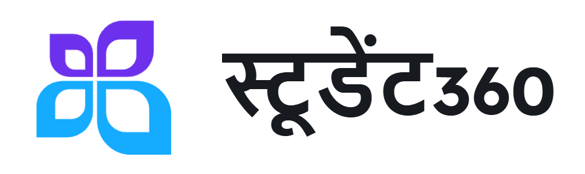

# Student 360 - Student Record Administration Solution

<p align="center">
  
  <br>
  <i>Empowering Educational Institutions with Seamless Student Data Management</i>
</p>

In the realm of education, efficient management of student information is crucial for the seamless operation of educational institutions. Student360, a comprehensive Student Record Administration Solution (SRAS), is designed to streamline administrative tasks and enhance data management.

Student360 is meticulously crafted to meet the diverse needs of educational administration. It offers a suite of features tailored to optimize user experience and system performance. With a focus on simplicity, effectiveness, and adaptability, Student360 aims to redefine how student information is managed within educational institutions.

## ✨ Features

| Feature | Description |
|---------|-------------|
| 🔐 **Secure Login Authentication** | Multi-level authentication system ensuring data security and privacy |
| 👤 **Student Profile Management** | Comprehensive profile creation with academic history, contact details, and more |
| 👨‍🏫 **Faculty Access Controls** | Role-based access for faculty members with student tracking capabilities |
| ⚙️ **Admin Panel** | Powerful dashboard for system configuration and user management |
| 💻 **Project Management** | Students can upload, update, and showcase their projects with documentation |
| 🏢 **Internship Management** | Track and verify student internships with offer letter uploads |
| 🏆 **Achievement Tracking** | Record and display academic and extracurricular achievements with certificate management |

## 🏗️ Architecture

```
                 ┌───────────────┐
                 │    Client     │
                 │    (React)    │
                 └───────┬───────┘
                         │
                         ▼
┌────────────────────────────────────────┐
│              Server (Node.js)          │
│                                        │
│  ┌─────────────┐       ┌────────────┐  │
│  │  Express.js │◄─────►│ Controllers│  │
│  └─────────────┘       └──────┬─────┘  │
│                               │        │
│  ┌─────────────┐       ┌──────▼─────┐  │
│  │ Middleware  │◄─────►│   Models   │  │
│  └─────────────┘       └──────┬─────┘  │
│                               │        │
└───────────────────────────────┼────────┘
                                │
                        ┌───────▼───────┐
                        │   Database    │
                        │   (MongoDB)   │
                        └───────────────┘
```

## 📸 Screenshots

<p align="center">
  <figure style="text-align: center; margin-bottom: 20px;">
  
  <figcaption style="font-size: 1.2em; color: #555; font-weight: bold; margin-top: 8px;">Login Screen</figcaption>
</figure>

<figure style="text-align: center; margin-bottom: 20px;">
  
  <figcaption style="font-size: 1.2em; color: #555; font-weight: bold; margin-top: 8px;">Student Dashboard</figcaption>
</figure>

<figure style="text-align: center;">
  
  <figcaption style="font-size: 1.2em; color: #555; font-weight: bold; margin-top: 8px;">Admin Panel</figcaption>
</figure>


</p>


## 🛠️ Tech Stack

- **Frontend**: React.js, Material-UI
- **Backend**: Node.js, Express.js
- **Database**: MongoDB
- **Authentication**: JWT
- **File Storage**: Cloudinary

## 🚀 Steps to Run the Project

1. **Clone the Repository**:
    ```sh
    git clone https://github.com/yourusername/Student360.git
    cd Student360
    ```

2. **Install Dependencies**:
    ```sh
    # Install server dependencies
    cd Server
    npm install
    
    # Install client dependencies
    cd ../Client
    npm install
    ```

3. **Set Up Environment Variables**:
    Create a `.env` file in the Server directory and add the necessary environment variables:
    ```env
    PORT=3000
    MONGODB_URI=your_mongodb_connection_string
    JWT_SECRET=your_jwt_secret_key
    CLOUDINARY_CLOUD_NAME=your_cloudinary_cloud_name
    CLOUDINARY_API_KEY=your_cloudinary_api_key
    CLOUDINARY_API_SECRET=your_cloudinary_api_secret
    ```

4. **Start the Development Server**:
    ```sh
    # Start the server (from the Server directory)
    npm run dev
    
    # In a separate terminal, start the client (from the Client directory)
    npm start
    ```

5. **Access the Application**:
    Open your browser and navigate to `http://localhost:3000`.

## 💡 Core Functionality

- **Student Management**: Create, read, update, and delete student profiles
- **Project Showcase**: Students can create a portfolio of their projects
- **Document Management**: Upload and manage academic and professional documents
- **Performance Analytics**: Track student growth and performance over time

<p align="center">Made with ❤️ by the Student360 Team</p>
